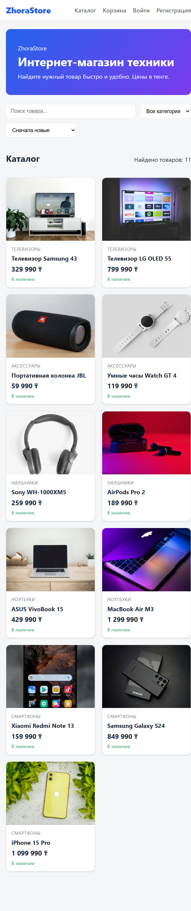
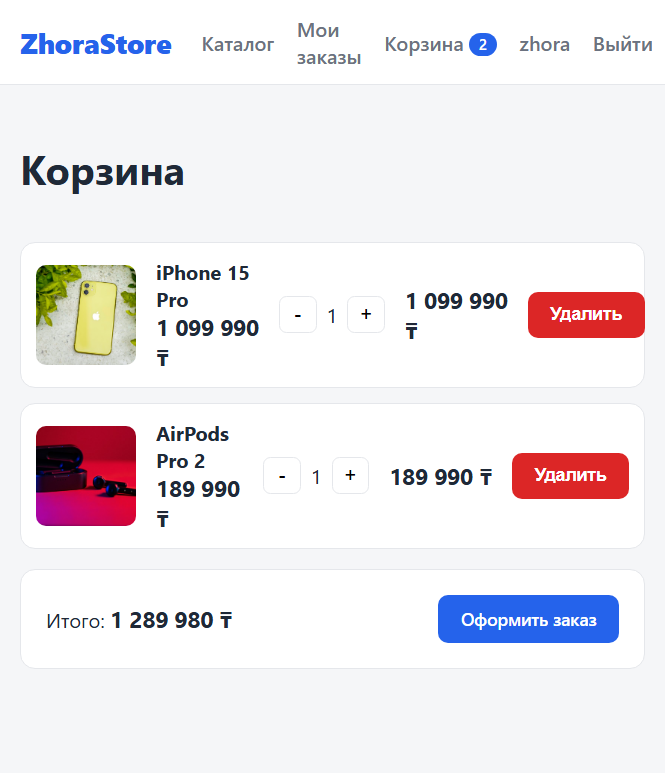
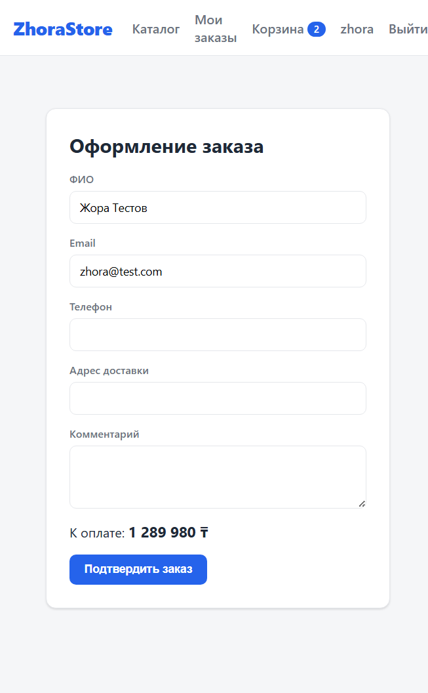
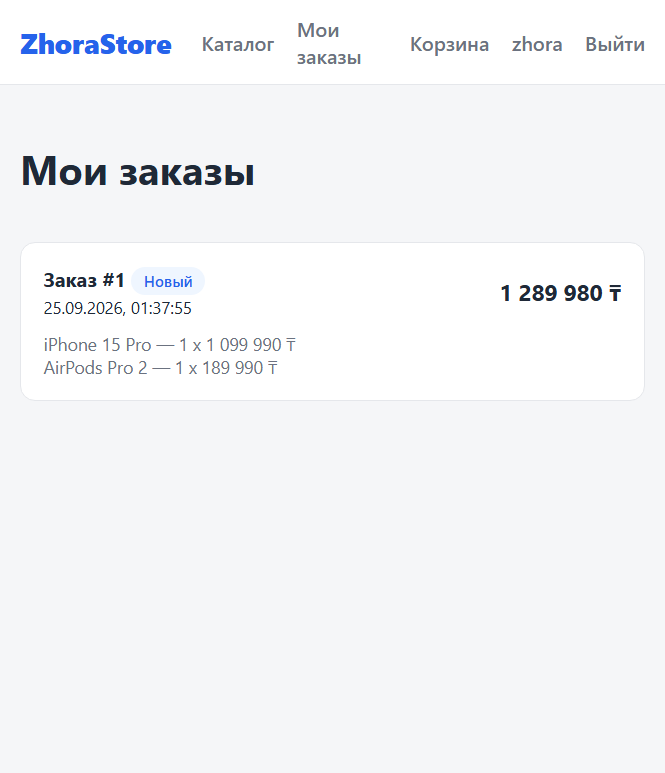
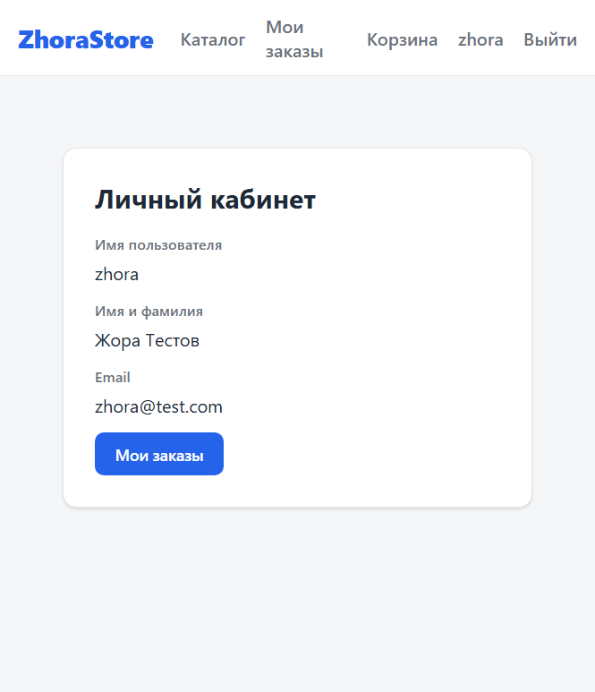
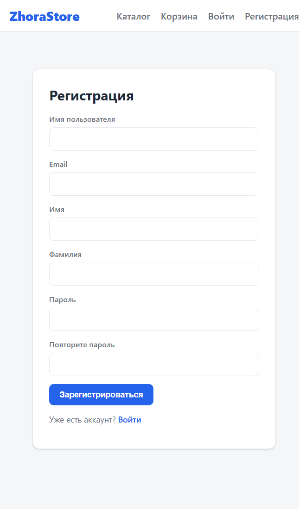
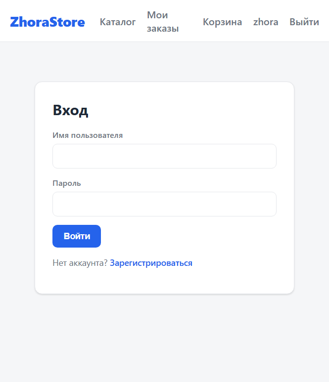
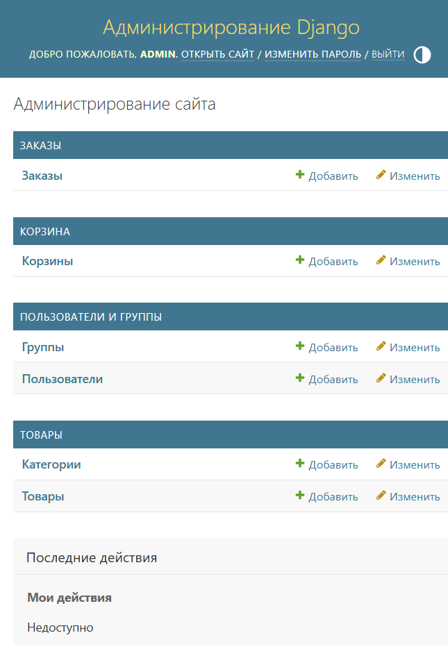

# ZhoraStore — Интернет-магазин

Полноценный интернет-магазин: каталог с поиском и фильтрами, регистрация и авторизация,
корзина, оформление и история заказов, личный кабинет и админ-панель.
Цены указаны в тенге (₸).

## Стек

**Backend:** Python, Django, Django REST Framework, SimpleJWT, PostgreSQL, django-filter, django-cors-headers.
**Frontend:** React, TypeScript, Vite, Axios, React Router.
**Прочее:** Git/GitHub. Без Docker и без тестов (по условию задания).

## Структура проекта

```
zhorastore/
├── backend/
│   ├── config/            # настройки Django, корневые URL
│   ├── accounts/          # регистрация и авторизация (JWT)
│   ├── products/          # категории, товары, поиск и фильтры
│   ├── cart/              # корзина покупателя
│   ├── orders/            # оформление и история заказов
│   ├── requirements.txt
│   ├── .env.example
│   └── manage.py
├── frontend/
│   ├── src/
│   │   ├── api/           # axios-клиент с JWT
│   │   ├── context/       # AuthContext, CartContext
│   │   ├── components/    # Header, ProductCard, ProtectedRoute
│   │   ├── pages/         # Catalog, ProductDetail, Login, Register, Cart, Checkout, Orders, Profile
│   │   ├── types/         # TypeScript-типы
│   │   └── utils/         # форматирование цен в тенге
│   ├── index.html
│   ├── package.json
│   └── vite.config.ts
├── screenshots/
├── .vscode/               # рекомендованные расширения и настройки VS Code
├── .gitignore
└── README.md
```

## Запуск

### 0. Открытие в VS Code

Откройте корень репозитория в VS Code (`code .` или «File → Open Folder»).
В папке [`.vscode/`](./.vscode) уже лежат `extensions.json` (рекомендованные
расширения: Python, Pylance, Django, ESLint, Prettier) и `settings.json`
(форматирование, пути анализа Python, исключения поиска). VS Code сам предложит
установить рекомендованные расширения.

### 1. PostgreSQL

Создайте базу данных:

```sql
CREATE DATABASE zhorastore;
```

### 2. Backend

```bash
cd backend
python -m venv .venv
.venv\Scripts\activate        # Windows
pip install -r requirements.txt

copy .env.example .env        # затем заполните .env (пароль PostgreSQL и SECRET_KEY)

python manage.py migrate
python manage.py seed_products      # демо-товары (цены в ₸)
python manage.py createsuperuser    # доступ в /admin/
python manage.py runserver          # http://127.0.0.1:8000
```

Переменные окружения (`.env`):

| Переменная | Описание | По умолчанию |
|---|---|---|
| `SECRET_KEY` | секретный ключ Django | — |
| `DEBUG` | режим отладки | `True` |
| `DB_ENGINE` | `postgresql` или `sqlite` | `postgresql` |
| `POSTGRES_DB` | имя базы | `zhorastore` |
| `POSTGRES_USER` | пользователь | `postgres` |
| `POSTGRES_PASSWORD` | пароль | — |
| `POSTGRES_HOST` | хост | `127.0.0.1` |
| `POSTGRES_PORT` | порт | `5432` |
| `CORS_ALLOWED_ORIGINS` | разрешённые origins | `http://localhost:5173` |

> **Быстрый демо-режим без PostgreSQL:** задайте в `.env` строку `DB_ENGINE=sqlite`.
> Django использует файл `backend/db.sqlite3`, остальные `POSTGRES_*` переменные
> можно не заполнять. Для продакшена оставьте `DB_ENGINE=postgresql`.

### 3. Frontend

```bash
cd frontend
npm install
copy .env.example .env        # VITE_API_URL=http://127.0.0.1:8000/api
npm run dev                   # http://localhost:5173
```

## API

### Авторизация (`/api/auth/`)

| Метод | Эндпоинт | Описание |
|---|---|---|
| POST | `/api/auth/register/` | Регистрация |
| POST | `/api/auth/login/` | Вход, выдаёт `access` и `refresh` JWT |
| POST | `/api/auth/refresh/` | Обновление `access`-токена |
| GET | `/api/auth/me/` | Текущий пользователь (требует токен) |

### Каталог (`/api/`)

| Метод | Эндпоинт | Описание |
|---|---|---|
| GET | `/api/categories/` | Список категорий |
| GET | `/api/products/` | Список товаров |
| GET | `/api/products/<id>/` | Страница товара |

Параметры `/api/products/`: `search`, `category` (слаг), `min_price`, `max_price`,
`is_available`, `ordering` (`price`, `-price`, `name`, `-created_at`).

### Корзина (`/api/cart/`, требует токен)

| Метод | Эндпоинт | Описание |
|---|---|---|
| GET | `/api/cart/` | Корзина пользователя с итогом |
| POST | `/api/cart/items/` | Добавить товар `{product_id, quantity}` |
| PATCH | `/api/cart/items/<id>/` | Изменить количество |
| DELETE | `/api/cart/items/<id>/` | Удалить позицию |

### Заказы (`/api/orders/`, требует токен)

| Метод | Эндпоинт | Описание |
|---|---|---|
| POST | `/api/orders/checkout/` | Оформить заказ из корзины |
| GET | `/api/orders/` | История заказов |
| GET | `/api/orders/<id>/` | Детали заказа |

### Админ-панель

`http://127.0.0.1:8000/admin/` — управление товарами, категориями, заказами и пользователями.

## Скриншоты

| Каталог | Страница товара |
|---|---|
|  |  |

| Корзина | Оформление заказа |
|---|---|
|  |  |

| История заказов | Личный кабинет |
|---|---|
|  |  |

| Регистрация | Вход | Админ-панель |
|---|---|---|
|  |  |  |

## Использование AI

При разработке проекта использовался AI-ассистент (Qoder). Весь код, созданный
преимущественно AI, помечен комментарием в первой строке файла:

- `# AI-GENERATED: Qoder` — для Python-файлов;
- `// AI-GENERATED: Qoder` — для TypeScript/TSX-файлов;
- `/* AI-GENERATED: Qoder */` — для CSS-файлов.

AI применялся для генерации каркаса моделей, сериализаторов, представлений DRF,
React-компонентов и конфигурации. Архитектура, структура проекта и интеграция
проверялись вручную. Секреты (`.env`, пароли, токены) в репозиторий не публикуются.
